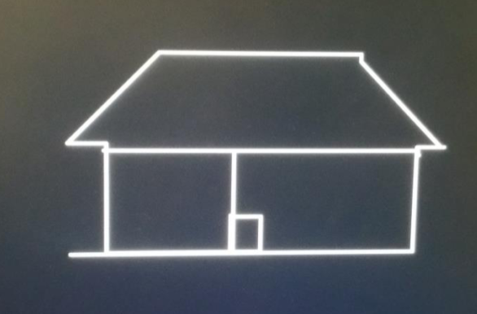
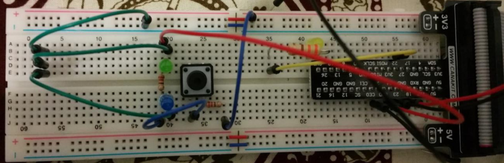

# Brief Description

A drawing program which starts from the centre or the screen, 4 buttons control which direction the pixel moves in. 
Holding down 2 buttons will cause the pixel to draw in a diagonal direction.

# Outline of Design

The aim of this project was to use input (button), output (screen + flashing led) and give user have some control over the program.

The initial design was built off week 10s lab, so for a majority of the screen drawing code I kept the same. The light(yellow) hooked up to GPIO 27 will flash 3 times to show we're ready to go.

# Wiring up Controls 

- GPIO 18 = Up
- GPIO 23 = Right 
- GPIO 24 = Down 
- GPIO 25 = Left

- GPIO 27 = Start-up Flashing Led

- GPIO 18 + GPIO 23 = Upper-Right 
- GPIO 23 + GPIO 24 = Downward-Right 
- GPIO 24 + GPIO 25 = Downward-Left
- GPIO 25 + GPIO 18 = Upper-Left
- GPIO 18 + GPIO 24 = Nothing
- GPIO 23 + GPIO 25 = Nothing

This image has a few unnecessary leds that were in place for testing purposes, 
and only one button since it's all I had on me at the time.

# Main Control Flow 

The program is broken in to two main sections: initialization and drawing loop. 

The initialization section is responsible for setting up the GPIO to allow input, output 
and event detection. It also initializes the frame buffer to allow drawing. When this section 
is complete we blink the LED three times to indicate the program is ready to start drawing.
 
The drawing loop performs three tasks: 

- Draw the dot on the screen
- Poll until input is detected 
- Handle the input

Most of these tasks are split up into functions which are detailed in the next section. 

# Key Assembly Features 

## `str/ldr` 

This program makes heavy use of the `str` and `ldr` assembly commands to read/write from the 
raspberry pi's memory. We store various patterns in memory to turn features on/off and we 
read from memory to check various inputs.

    mov r0,BASE
	orr r0,GPIO_OFFSET ;r0 now equals 0x3F200000
	
	; Set bit 21 of GPFSEL2 to enable output on GPIO27 (see broadcom datasheet)
	mov r1,#1
	lsl r1,#21
	str r1,[r0,GPFSEL2_OFFSET]
	
## the stack (push/pop)

Because the program is split into many functions we use the stack a lot to preserve registers 
so our subroutine don't override them. In particular we need to preserve the link register 
to make sure we can branch back from a nested subroutine correctly

## Conditionals

A lot of the logic is conditional and we make a lot of use of the ability to suffix 
instructions with a conditional check. In particular the movement code makes a lot of use 
of `tst`, `addne` and `subne` to move the pixel around in response to button pushes.

    ; If 18 was pushed, move up
	mov r1,#1
	lsl r1,#18
	tst r0,r1                 ; tst will return "not equal" if the 18th bit is set
	subne r9,r9,#1            ; for both r0 and r1
	
## Branching

The program does a lot of branching both conditional and unconditional. We make heavy use
of `b`, `bx, `bl`, `bne`, `beq` and other branch based operations.

# Functions

## FB_Init

Taken from the Week 10 lab. This sets up the framebuffer and gives us a pointer to it in
register 0. We need to run this before we can draw anything.

## enable_buttons

This function enables GPIO input for the pins we are using. Because we want to detect when 
the button is held down we're using the build-in high-event detection which will write to 
the GPIO event detection register whenever a button is held down.

To make buttons work we also need to enable pull-up or pull-down. In this case we want to 
use pull-down so the pin reads 0 when a button is not pushed. 

All of this is done by writing specific bits to specific memory locations.

## enable_led

This function enables GPIO output for the LED pin. We just need to set the appropriate bit 
to tell the raspberry pi to allow output on the GPIO pin.

## blink_led

This function works by writing to the GPIO SET/CLEAR registers to make the LED blink. It 
also uses the delay function to make the blinks visible as they are too fast otherwise.

## drawsquare

Drawsquare is used to draw the 2px cursor used for the etch-a-sketch. I could have written 
a simpler function but since I already had drawsquare working I decided to use it.

It works by drawing four lines using the drawline function. Because drawline is capable of 
drawing horizontal and vertical lines it was very useful for this function.

## drawline

drawline is used to draw a line of pixels. It takes a starting position (x and y), how much 
to increment in each direction and how many pixels to draw. This means it can draw vertical, 
horizontal and diagonal lines. It could also draw dotted lines.

It works by calling drawpixel in a loop and incrementing the stored x and y positions for each 
iteration of the loop.

## drawpixel 

This function was modified from the Week 10 example. I wasn't using the 16 bit parts of the 
code so I removed them to make it easier to read. It works by writing the 8-bit colour value 
to the appropriate part of the framebuffer.

## poll_for_any_button_press

This function is used to detect if any combination of buttons has been pressed. It works 
by reading the event detection register and comparing it against a specific binary pattern 
using the tst command. If any of the bits match then we exit from a loop and return the 
entire bit pattern.

This function blocks the program until at least one button is pressed.

The bit pattern is returned fully so the main drawing loop can check which buttons have been 
pushed. This also lets us handle multiple inputs at the same time.

## wait_150_cycles

This function waits for exactly 150 cycles. It's needed because part of setting up the 
pull-down GPIO mode involves waiting for 150 cycles as outlined by the raspberry pi technical 
documentation.

It works by looping 150 times and then exiting.

## delay

This function pauses program execution for a given number of milliseconds. It works by 
reading the current time out of memory and then entering a loop. In the loop it reads the 
current time continually and compares it against the original time. Once the comparison gets 
large enough to exceed the delay the loop exits and the program continues.

This is mainly useful for making sure the program doesn't draw too quickly and for helping 
with LED blink timings.

# Unresolved Issues

- The drawing pixel can go off the screen vertically but it will come back. 
  It wraps horizontally.

# References

- Swinburne University COS10004: Computer Systems Labs 7-10 
- https://www.raspberrypi.org/documentation/hardware/raspberrypi/bcm2835/BCM2835-ARM-Peripherals.pdf 
- http://infocenter.arm.com/help/topic/com.arm.doc.qrc0001m/QRC0001_UAL.pdf 
- http://infocenter.arm.com/help/index.jsp?topic=/com.arm.doc.dui0552a/BABFFEJF.html 
- http://www.davespace.co.uk/arm/introduction-to-arm/ 
- https://github.com/metachris/RPIO/blob/c4e8b73407ddec416d5cabf5057f5ddf8b699c99/source/c_gpio/c_gpio.c 
- http://raspi.tv/2013/rpi-gpio-basics-6-using-inputs-and-outputs-together-with-rpi-gpio-pull-ups-and-pull-downs
- https://www.cl.cam.ac.uk/projects/raspberrypi/tutorials/os/screen01.html